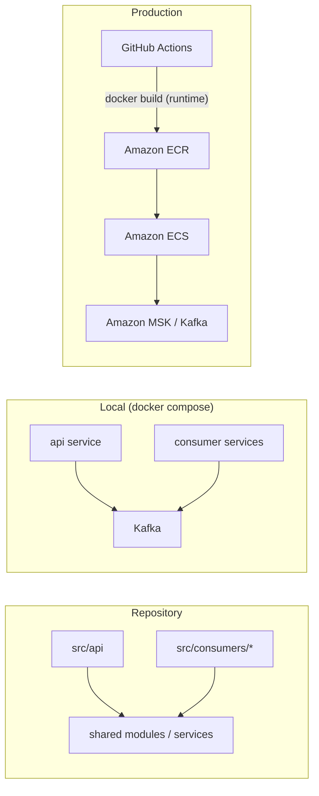
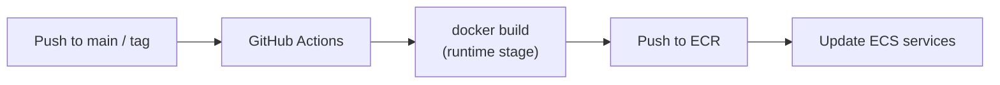

# Deployment

This project is a **modulith**: one codebase, one Docker image, multiple independently deployable processes (API + Kafka consumers).

## Architecture overview



| Process  | Role                                         | Typical entrypoint                  |
| -------- | -------------------------------------------- | ----------------------------------- |
| API      | HTTP server, publishes events                | `node dist/api/app.js`              |
| Consumer | Subscribes to one Kafka topic, runs handlers | `node dist/consumers/<name>/app.js` |

Each consumer lives under `src/consumers/` and maps to **one topic**. Add a new consumer when a new topic needs its own processing logic or scaling profile.

Example layout (future):

```
src/
  api/
    app.ts
  consumers/
    user-events/
      app.ts          # consumes topic: user-events
    order-events/
      app.ts          # consumes topic: order-events
```

---

## Docker image

A single multi-stage `Dockerfile` produces different targets:

| Stage          | Used for              | Contents                       |
| -------------- | --------------------- | ------------------------------ |
| `development`  | Local dev via compose | Source, dev deps, `tsx watch`  |
| `install-deps` | Build intermediate    | Production `node_modules` only |
| `build`        | Build intermediate    | Compiles TypeScript → `dist/`  |
| `runtime`      | **Production**        | Production deps + `dist/` only |

Build the production image (default target):

```bash
docker build -t node-modulith:local .
```

The default `CMD` starts the API:

```
node dist/api/app.js
```

Consumers use the **same image** with a **command override** at deploy time.

---

## Local development

Local dev uses **docker compose**, not the `runtime` stage.

```bash
npm run dev
# → docker compose up --build
```

Compose builds the `development` target, bind-mounts the repo for hot reload, and preserves container `node_modules` via an anonymous volume.

Each service (API, consumers, Kafka) is a separate compose service on a shared network. This mirrors production topology — multiple processes, shared infra — without being the production deployment mechanism itself.

When adding a consumer locally:

```yaml
# docker-compose.yaml
event-consumer:
  build:
    context: .
    target: development
  command: npx tsx watch src/consumers/user-events/app.ts
  environment:
    KAFKA_BROKERS: kafka:9092
    KAFKA_TOPIC: user-events
  volumes:
    - .:/usr/src/app
    - /usr/src/app/node_modules
  depends_on:
    - kafka
```

---

## Production pipeline: GitHub Actions → ECR → ECS



### 1. GitHub Actions (CI)

On merge to `main` or on release tag:

1. Checkout code
2. Configure AWS credentials (OIDC or secrets)
3. Log in to ECR
4. Build the `runtime` image
5. Tag with git SHA and/or semver (e.g. `1.2.3`, `abc1234`)
6. Push to ECR

Conceptual workflow step:

```yaml
- run: docker build -t $ECR_REGISTRY/node-modulith:$IMAGE_TAG .
- run: docker push $ECR_REGISTRY/node-modulith:$IMAGE_TAG
```

The workflow builds **once** and pushes **one image**. It does not start the application.

### 2. Amazon ECR (artifact registry)

ECR stores immutable image tags. All ECS services reference the same repository:

```
123456789012.dkr.ecr.<region>.amazonaws.com/node-modulith:abc1234
```

### 3. Amazon ECS (runtime orchestration)

Each process is a separate **ECS service** with its own task definition. Services share the ECR image URI but differ in command, environment, scaling, and networking.

| ECS service                  | Image                       | Command override                                       | Load balancer |
| ---------------------------- | --------------------------- | ------------------------------------------------------ | ------------- |
| `api`                        | `.../node-modulith:abc1234` | _(none — image's default `CMD`)_                       | Yes (ALB)     |
| `user-marketing-consumer`    | `.../node-modulith:abc1234` | `node dist/consumers/user-marketing-consumer/index.js` | No            |
| `product-restocked-consumer` | `.../node-modulith:abc1234` | `node dist/consumers/product-restocked/index.js`       | No            |

The API's ALB target group needs a real health-check route — `GET /health` (mounted in `src/api/modules/app-router.ts`) exists for exactly this.

**Independent deployments:** updating the API service task definition rolls out API tasks only. Consumer services stay on their current task definition until explicitly updated to the new image tag.

**Independent scaling:** consumer replica count is tied to Kafka partition count (max parallel consumers per group = partition count). Scale each ECS service separately.

---

## Kafka

| Environment | Broker                        | Topics                                         |
| ----------- | ----------------------------- | ---------------------------------------------- |
| Local       | Kafka container in compose    | Created via init script or CLI                 |
| Production  | Amazon MSK (or managed Kafka) | Provisioned via IaC; explicit partition counts |

The API publishes to topics. Each consumer subscribes to **one topic** with its own consumer group. Topic names and message schemas should match across environments; partition counts may differ (fewer locally, more in prod).

---

## Configuration and secrets

Environment variables are **not** baked into the image.

| Environment   | How config is provided                                               |
| ------------- | -------------------------------------------------------------------- |
| Local compose | `environment:` / `env_file:` in `docker-compose.yaml`                |
| ECS           | Task definition env vars + AWS Secrets Manager / SSM Parameter Store |

Common variables:

| Variable          | Used by                            |
| ----------------- | ---------------------------------- |
| `PORT`            | API                                |
| `NODE_ENV`        | API                                |
| `KAFKA_BROKERS`   | API (produce), consumers (consume) |
| `KAFKA_CLIENT_ID` | Consumers                          |
| `KAFKA_GROUP_ID`  | Consumers                          |

Never commit secrets. Never `COPY` env files into the production image.

---

## What lives where

| Concern                     | Location                                        |
| --------------------------- | ----------------------------------------------- |
| How to build the image      | `Dockerfile`                                    |
| Local full-stack dev        | `docker-compose.yaml`, `npm run dev`            |
| Compile TypeScript          | `npm run compile` (used inside Docker build)    |
| CI build + push             | `.github/workflows/` (future)                   |
| Prod run commands + scaling | ECS task definitions / Terraform / CDK (future) |
| Kafka cluster               | MSK (prod), compose service (local)             |

`package.json` does not define production start commands. Process entrypoints live in the Dockerfile (`CMD` default) and are overridden per service in compose (local) or ECS (production).

---

## Adding a new consumer

1. Create `src/consumers/<topic-name>/app.ts` with subscribe/handle loop and graceful shutdown.
2. Add a compose service for local dev (`target: development`, `tsx watch`).
3. Ensure the topic exists (local init script; prod IaC).
4. Add an ECS service + task definition with:
   - Same ECR image tag as API
   - `command: ["node", "dist/consumers/<name>/index.js"]`
   - Consumer-specific env (`KAFKA_CLIENT_ID`, `KAFKA_GROUP_ID`, `KAFKA_BROKERS`) — the topic itself is not env-driven, it's hardcoded via the `Topics` enum in the consumer's code
5. Deploy the new ECS service independently of the API.

---

## Testing the production image locally

Build and run the `runtime` stage without compose volumes:

```bash
docker build -t node-modulith:local .
docker run --rm -p 3000:3000 -e PORT=3000 node-modulith:local
```

This validates the same artifact CI pushes to ECR — compiled output, production dependencies, no bind mounts.
